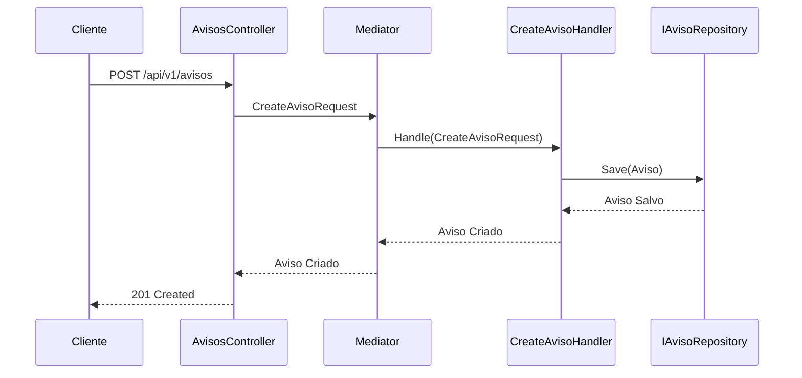
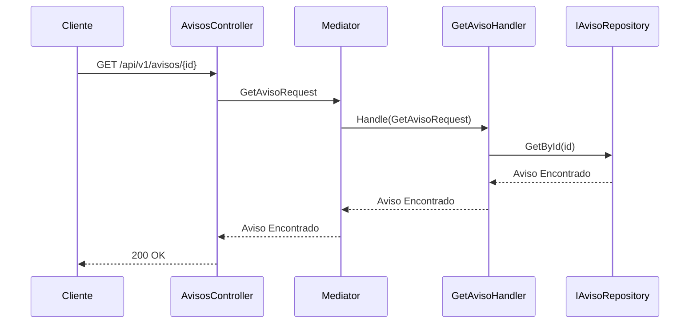
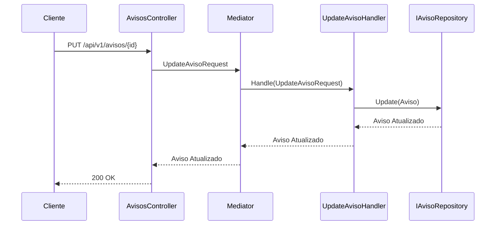
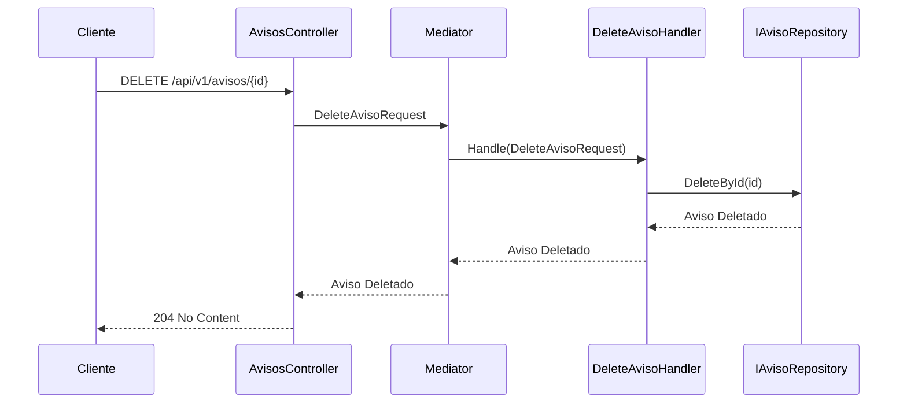
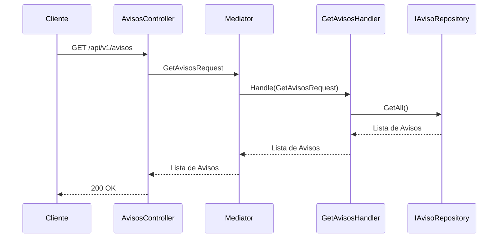

# Projeto BasicoDotNet

Este é um projeto  em .NET para um sistema de aviso

## Instalação

Para instalar o projeto, siga os passos abaixo:

1. Restaure as dependências do projeto:
    ```sh
    dotnet restore
    ```

## Uso

Para executar o projeto, utilize o comando:
```sh
dotnet run --project <caminho_para_o_projeto>
```

## Testes

Para executar os testes, utilize o comando:
```sh
dotnet test
```

## Fluxo de Avisos

### 1. Criar Aviso

**Rota:** `POST /api/v1/avisos`

**Descrição:** Cria um novo aviso.

**Fluxo:**
- A requisição é recebida pelo método `CreateAviso` no `AvisosController`.
- O método chama o `Mediator` para enviar o comando `CreateAvisoRequest`.
- O comando é tratado pelo `CreateAvisoHandler`, que utiliza o repositório `IAvisoRepository` para salvar o aviso no banco de dados em memória.
- Retorna `201 Created` se o aviso for criado com sucesso ou `400 Bad Request` se houver dados inválidos.



### 2. Obter Aviso por ID

**Rota:** `GET /api/v1/avisos/{id}`

**Descrição:** Retorna um aviso específico pelo ID.

**Fluxo:**
- A requisição é recebida pelo método `GetAviso` no `AvisosController`.
- O método chama o `Mediator` para enviar a consulta `GetAvisoRequest`.
- A consulta é tratada pelo `GetAvisoHandler`, que utiliza o repositório `IAvisoRepository` para buscar o aviso no banco de dados em memória.
- Retorna `200 OK` com o aviso se encontrado ou `404 Not Found` se o aviso não for encontrado.



### 3. Atualizar Aviso

**Rota:** `PUT /api/v1/avisos/{id}`

**Descrição:** Atualiza um aviso existente.

**Fluxo:**
- A requisição é recebida pelo método `UpdateAviso` no `AvisosController`.
- O método chama o `Mediator` para enviar o comando `UpdateAvisoRequest`.
- O comando é tratado pelo `UpdateAvisoHandler`, que utiliza o repositório `IAvisoRepository` para atualizar o aviso no banco de dados em memória.
- Retorna `200 OK` se o aviso for atualizado com sucesso ou `400 Bad Request` se houver dados inválidos.



### 4. Deletar Aviso

**Rota:** `DELETE /api/v1/avisos/{id}`

**Descrição:** Deleta um aviso específico pelo ID.

**Fluxo:**
- A requisição é recebida pelo método `DeleteAviso` no `AvisosController`.
- O método chama o `Mediator` para enviar o comando `DeleteAvisoRequest`.
- O comando é tratado pelo `DeleteAvisoHandler`, que utiliza o repositório `IAvisoRepository` para marcar o aviso como deletado no banco de dados em memória.
- Retorna `204 No Content` se o aviso for deletado com sucesso ou `404 Not Found` se o aviso não for encontrado.



### 5. Obter Todos os Avisos

**Rota:** `GET /api/v1/avisos`

**Descrição:** Retorna todos os avisos cadastrados.

**Fluxo:**
- A requisição é recebida pelo método `GetAvisos` no `AvisosController`.
- O método chama o `Mediator` para enviar a consulta `GetAvisosRequest`.
- A consulta é tratada pelo `GetAvisosHandler`, que utiliza o repositório `IAvisoRepository` para buscar todos os avisos no banco de dados em memória.
- Retorna `200 OK` com a lista de avisos ou `204 No Content` se não houver avisos cadastrados.



